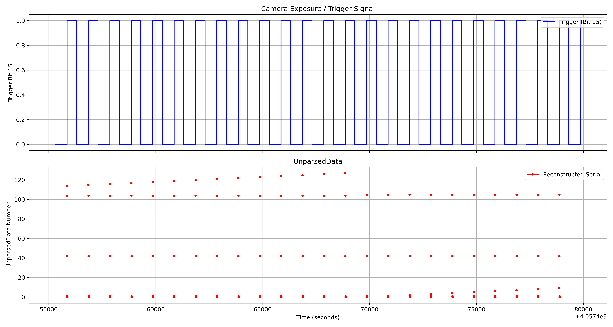

## NEV File Structure

The `.nev` file format, developed by BlackRock Microsystems, is designed to store timestamped neural events such as spikes, TTL pulses, and serial messages. It supports up to 10,000 electrodes and includes both metadata and raw event data, structured to balance flexibility, efficiency, and ease of parsing.

A NEV file consists of three main components:

- Basic Header
- Extended Headers
- Data Packets

### Basic Header

The basic header contains global metadata about the recording session, including the timestamp resolution and the origin of time. You can inspect it using `pyvideosync.nev.get_basic_header`. Key fields:

- **TimeStampResolution**: Number of timestamp ticks per second (e.g., 30,000 means 1 tick = 33.3 μs).
- **SampleTimeResolution**: Used for waveform sampling resolution, often the same as TimeStampResolution.
- **TimeOrigin**: The UTC time when the recording started.

```python
>>> nev.get_basic_header()
{'FileTypeID': 'BREVENTS',
 'FileSpec': '3.0',
 'AddFlags': 1,
 'BytesInHeader': 26512,
 'BytesInDataPackets': 108,
 'TimeStampResolution': 30000,
 'SampleTimeResolution': 30000,
 'TimeOrigin': datetime.datetime(2024, 7, 17, 11, 55, 38, 670000),
 'CreatingApplication': 'File Dialog v7.6.1',
 'Comment': '',
 'NumExtendedHeaders': 818}
```

MATLAB users can utilize the [NPMK package](https://github.com/BlackrockNeurotech/NPMK/tree/master) from Blackrock Neurotech to read `.nev` files. The primary function for this is `openNEV`, which loads metadata, spike data, and digital events into a structured object.

To load a NEV file and access its metadata:

```matlab
openNEV('filename.nev', 'read');
```

This will return a `NEV` struct. The metadata fields are accessible via:

```matlab
NEV.MetaTags
```

This is functionally equivalent to calling `get_basic_header()` in the Python API.

Below is an example view of the `MetaTags` structure in MATLAB:


### Extended Headers

Extended headers in the NEV file contain channel-specific metadata, such as electrode labeling, waveform configuration, and filter settings. These entries provide essential information for interpreting neural data and are stored as a list of dictionaries in the Python API. Each entry is identified by a `PacketID`, which indicates the type of metadata.

Common `PacketID` types include:

- `NEUEVWAV`: Waveform extraction settings
- `NEUEVLBL`: Electrode label
- `NEUEVFLT`: Filter parameters

Example:

```python
>>> nev.get_extended_headers()
[{'PacketID': 'NEUEVWAV',
  'ElectrodeID': 1,
  'PhysicalConnector': 1,
  'ConnectorPin': 1,
  'DigitizationFactor': 250,
  'EnergyThreshold': 0,
  'HighThreshold': 0,
  'LowThreshold': -255,
  'NumSortedUnits': 0,
  'BytesPerWaveform': 2,
  'SpikeWidthSamples': 48,
  'EmptyBytes': b'\x00\x00\x00\x00\x00\x00\x00\x00'},
 {'PacketID': 'NEUEVLBL',
  'ElectrodeID': 1,
  'Label': 'LdPF-mPF01-001',
  'EmptyBytes': b'\x00\x00\x00\x00\x00\x00'},
 {'PacketID': 'NEUEVFLT',
  'ElectrodeID': 1,
  'HighFreqCorner': '250.0 Hz',
  'HighFreqOrder': 4,
  'HighFreqType': 'butterworth',
  'LowFreqCorner': '7500.0 Hz',
  'LowFreqOrder': 3,
  'LowFreqType': 'butterworth',
  'EmptyBytes': b'\x00\x00'},
  ...
]
```

In MATLAB, this information is available through the `NEV.ElectrodesInfo` structure when using the [NPMK](https://github.com/BlackrockNeurotech/NPMK) package:

```matlab
NEV = openNEV('filename.nev', 'read');
NEV.ElectrodesInfo
```

This structure contains similar metadata, such as channel labels, thresholds, and filter settings.


### Data Packets
The `.nev` file also contains the actual timestamped events, such as TTL pulses or encoded serial data.

```python
nev = Nev(nev_path)
nev_digital_events_df = nev.get_digital_events_df()
```

{{ read_csv('understanding-nev/digital_events_df_first_20_rows.csv') }}

Key columns:

- **TimeStamps**: Integer-based timestamps with TimeStampResolution frequency (e.g., 30,000 Hz).
- **InsertionReason**: An 8-bit flag indicating why the event was inserted (e.g., digital change, serial input).
- **UnparsedData**: The raw 16-bit digital input or 7-bit serial payload (depending on the flag).

In MATLAB, the same data can be accessed using the [NPMK package](https://github.com/BlackrockNeurotech/NPMK). After loading the NEV file with `openNEV`, digital events are available in:

```matlab
NEV = openNEV('filename.nev', 'read');
NEV.Data.SerialDigitalIO
```


## Understanding `InsertionReason`

The `InsertionReason` field in the NEV file is a **bitwise flag** that encodes the reason a particular event was recorded. Each bit represents a specific condition or source for the event. Multiple bits may be set simultaneously.

### Relevant Values

| Value | Binary (8-bit) | Meaning |
|-------|----------------|---------|
| `1`   | `00000001`     | A **digital channel** changed state (e.g., camera trigger line toggled) |
| `129` | `10000001`     | A **serial channel** changed, and a digital change occurred (i.e., a serial byte was received) |

### Bitwise Breakdown (from BlackRock NEV Specification)

The `InsertionReason` byte is defined as follows:

| Bit | Meaning |
|-----|---------|
| **0** | Digital channel changed (e.g., rising/falling edge on a trigger line) |
| **1** | Event is from a strobed input |
| **2–6** | Reserved (unused) |
| **7** | Serial channel changed (must be set alongside Bit 0) |

### Interpretation

- `0b00000001` (decimal `1`) → Digital event only  
- `0b10000001` (decimal `129`) → Serial event (with digital change)

### Usage

- Use rows where `InsertionReason == 1` to extract **digital trigger events** (e.g., camera exposure).
- Use rows where `InsertionReason == 129` to reconstruct **serial counter values** sent from Arduino in 5-byte chunks.

This distinction is crucial for synchronizing camera frames with external signals such as triggers or Arduino-based serial counters.

## Understanding `UnparsedData`

### How Trigger and Serial are sent from Arduino

The Arduino transmits both a trigger pulse and a serial-encoded counter value every frame:

The trigger pulse is sent via a digital output pin (e.g., pin 13) to the camera to initiate image capture.
Simultaneously, the counter value is incremented and transmitted over three serial ports — in the current setup, two going to the PCBs (used by the cameras) and one to the audio interface.

To ensure compatibility with the camera's serial input requirements, the counter value (a 32-bit unsigned integer) is split into 5 separate bytes, with each byte containing 7 bits of actual data. This is done because:

- The camera expects each byte to begin with a start bit
- It can only receive one byte at a time, and only uses the lower 7 bits of each byte for data.
- Therefore, transmitting the full 32-bit value requires 5 bytes (since 5 × 7 = 35 bits), with the upper 3 bits simply unused if not needed.

The splitting and transmission are handled by this Arduino function:

```c++
bool send_trigger_sync_to_pcb(void *) {
  digitalWrite(trigger_pin, HIGH);

  byte bytesToSend[5]; // Create an array to store the 5 bytes
  // Split the 32-bit integer into 5 bytes, each carrying 7 bits
  for (int i = 0; i < 5; i++) {
    // Shift right by 7 bits times the index and mask out the lower 7 bits
    bytesToSend[i] = (count >> (7 * i)) & 0x7F;
  }
  //Send each byte over serial
  for (int i = 0; i < 5; i++) {
    Serial1.write(bytesToSend[i]);
    Serial2.write(bytesToSend[i]);
    Serial3.write(bytesToSend[i]);
    Serial1.flush();
    Serial2.flush();
    Serial3.flush();
  }
  digitalWrite(trigger_pin, LOW);
  count = count + 1;
  return true;
}
```

### How Trigger and Serial are encoded in `UnparsedData`

The UnparsedData field in the NEV digital events dataframe holds different meanings depending on the value of the InsertionReason flag.

For `InsertionReason == 1`, the `UnparsedData` value represents a 16-bit unsigned integer encoding the state of all 16 digital input lines. Each bit corresponds to a specific digital channel—commonly used for camera exposure signals or TTL triggers. Since the NEV file only records changes in digital line state (i.e., rising or falling edges), the data is **sparse** in time. To reconstruct the square waveforms of digital signals (such as camera exposure or external triggers), the following steps are required:

- Filter digital events where `InsertionReason == 1`.
- Convert UnparsedData into a 16-bit binary representation.
- Fill in gaps between timestamps to create a continuous time axis, since intermediate bit states are not recorded.
- Extract the state of the specific bit corresponding to the channel of interest.
- Plot the decoded signal as a square wave.

This process is encapsulated in the `nev.plot_cam_exposure_all` function, which generates clear, continuous exposure traces:


When `InsertionReason` is `129`, the UnparsedData value represents a 7-bit payload from serial communication. The Arduino transmits a 32-bit integer over serial by encoding it into five 7-bit bytes, each stored as a separate event with `InsertionReason == 129`.

To decode the full serial message:

- Group every 5 consecutive rows with `InsertionReason == 129`.
- Extract the 7-bit data values from UnparsedData.
- Reconstruct the original 32-bit integer by reversing the bit-shifting process.

Each such 5-row group represents a complete serial counter value synchronized with a trigger pulse. This data can then be used for precise alignment between camera frames and neural events.

### How Serial Number is reconstructed from 5 Bytes

In this system, a 32-bit integer counter is transmitted from the Arduino in the form of 5 bytes, where each byte encodes 7 bits of actual data. Both the camera system and the BlackRock recording system receive this data and must reconstruct the original 32-bit counter value.

#### From the Camera Side

In the [camera recording software](https://github.com/BCM-Neurosurgery/MultiCameraTracking/blob/main/multi_camera/acquisition/flir_recording_api.py), each byte is masked with 0x7F to retain only the lower 7 bits. The bytes are then shifted and combined to reconstruct the full 32-bit counter value.

```python
def process_serial_data(self, c):
    serial_msg = []
    frame_count = -1
    if self.gpio_settings['line3'] == 'SerialOn':
        # We expect only 5 bytes to be sent
        if c.ChunkSerialDataLength == 5:
            chunk_serial_data = c.ChunkSerialData
            serial_msg = chunk_serial_data
            split_chunk = [ord(c) for c in chunk_serial_data]

            frame_count = 0
            for i, b in enumerate(split_chunk):
                frame_count |= (b & 0x7F) << (7 * i)
```

#### From the NEV (BlackRock) Side

On the BlackRock system, serial data is captured within the `.nev` file and appears in rows where `InsertionReason == 129`. Each complete serial transmission occupies 5 consecutive rows in the event stream.

The NEV processing workflow involves:

- Filtering valid groups of 5 rows.
- Extracting the UnparsedData field from each row.
- Converting the 5 × 7-bit chunks back into a single integer.
- Apply fix-anomaly scripts to fill in the gaps of the serial stream (Refer to edge cases documentation).

```python
def get_cleaned_digital_events_df(self):
    """
    only keep the rows which satisfy
    1. InsertionReason == 129
    2. the length of such group is 5
    3. 0 <= UnparsedData <= 127 (should be true enforced by hardware)

    Returns
        InsertionReason 	TimeStamps 	UnparsedData
    2 	129 	            1345819 	40
    3 	129 	            1345822 	76
    4 	129 	            1345825 	35
    5 	129 	            1345828 	0
    6 	129 	            1345831 	0
    """
    digital_events_df = self.get_digital_events_df()
    # True indicates a change from 1 -> 129 or 129 -> 1
    digital_events_df["group"] = (
        digital_events_df["InsertionReason"]
        != digital_events_df["InsertionReason"].shift(1)
    ).cumsum()
    # Count the size of each group and assign True where the group size
    # is 5 and the reason is 129
    digital_events_df["keeprows"] = digital_events_df.groupby("group")[
        "InsertionReason"
    ].transform(lambda x: (x == 129) & (x.size == 5))
    digital_events_df = digital_events_df[digital_events_df["keeprows"] == True]
    digital_events_df = digital_events_df.drop(["group", "keeprows"], axis=1)
    return digital_events_df

def bits_to_decimal(self, nums: list) -> int:
    """
    nums: [19, 101, 37, 0, 0]

    Returns:
    619155
    """
    # Convert each number to a 7-bit binary string with leading zeros
    binary_strings = [format(num, "07b") for num in nums][::-1]
    # Concatenate all binary strings into one long binary string
    full_binary_string = "".join(binary_strings)
    # Convert the concatenated binary string to a decimal number
    return int(full_binary_string, 2)

def get_chunk_serial_df(self, timestamp_byte: str = "first"):
    """Reconstruct chunk serial numbers from grouped digital events.

    Processes the cleaned digital events DataFrame by grouping every five consecutive rows,
    reconstructing each chunk serial number from the grouped 7-bit encoded values, and
    associating it with a corresponding timestamp. The timestamp used for each group
    can be explicitly selected as either the first or last byte in the group.

    Args:
        timestamp_byte (str, optional): Which byte's timestamp to use ('first' or 'last').
            Defaults to 'first'. Use 'last' if you want the timestamp representing
            the full completion of the serial transmission (recommended for accurate synchronization).

    Returns:
        pd.DataFrame: A DataFrame containing:
            - `TimeStamps`: Timestamp from the NEV data (based on selected byte).
            - `chunk_serial`: Reconstructed chunk serial number.
            - `UTCTimeStamp`: Human-readable UTC timestamp.

    Raises:
        AssertionError: If unparsed data is unavailable or timestamp_byte parameter is invalid.

    Example:
        >>> nev.get_chunk_serial_df(timestamp_byte='last')
                TimeStamps  chunk_serial              UTCTimeStamp
        0         1345819       583208  2024-04-16 21:48:17.195433
        1         1346821       583209  2024-04-16 21:48:17.228833
    """
    assert self.has_unparsed_data(), "No unparsed data available."
    assert timestamp_byte in [
        "first",
        "last",
    ], "timestamp_byte must be either 'first' or 'last'"

    df = self.get_cleaned_digital_events_df()
    results = []

    for i in range(0, len(df), 5):
        group = df.iloc[i : i + 5]
        if len(group) == 5:
            nums = group["UnparsedData"].tolist()
            decimal_number = self.bits_to_decimal(nums)

            # explicitly choose which byte's timestamp to use
            if timestamp_byte == "first":
                timestamp = group["TimeStamps"].iloc[0]
            else:  # timestamp_byte == 'last'
                timestamp = group["TimeStamps"].iloc[-1]

            unix_time = ts2unix(
                self.timeOrigin, self.timestampResolution, timestamp
            )
            results.append((timestamp, decimal_number, unix_time))

    # Explicitly fill missing serials if necessary
    results = fill_missing_serials_with_gap(results)

    return pd.DataFrame.from_records(
        results, columns=["TimeStamps", "chunk_serial", "UTCTimeStamp"]
    )
```

### Timing Between Trigger and Serial

According to the Arduino code, the trigger pulse is initiated immediately before the serial data transmission begins:

```c++
bool send_trigger_sync_to_pcb(void *) {
  digitalWrite(trigger_pin, HIGH);

  // code to sent serial...

  digitalWrite(trigger_pin, LOW);
  count = count + 1;
  return true;
}
```

When observing the NEV recording, we find that the trigger pulse is captured exactly one timestamp before the first byte of the 5-byte serial transmission. This confirms the ordering and tight timing between the two signals. This relationship is visualized in the following figure:



This precise sequencing is essential for synchronizing camera frames with neural recordings. The reliable 1-timestamp offset can be leveraged during analysis to align data streams accurately.
